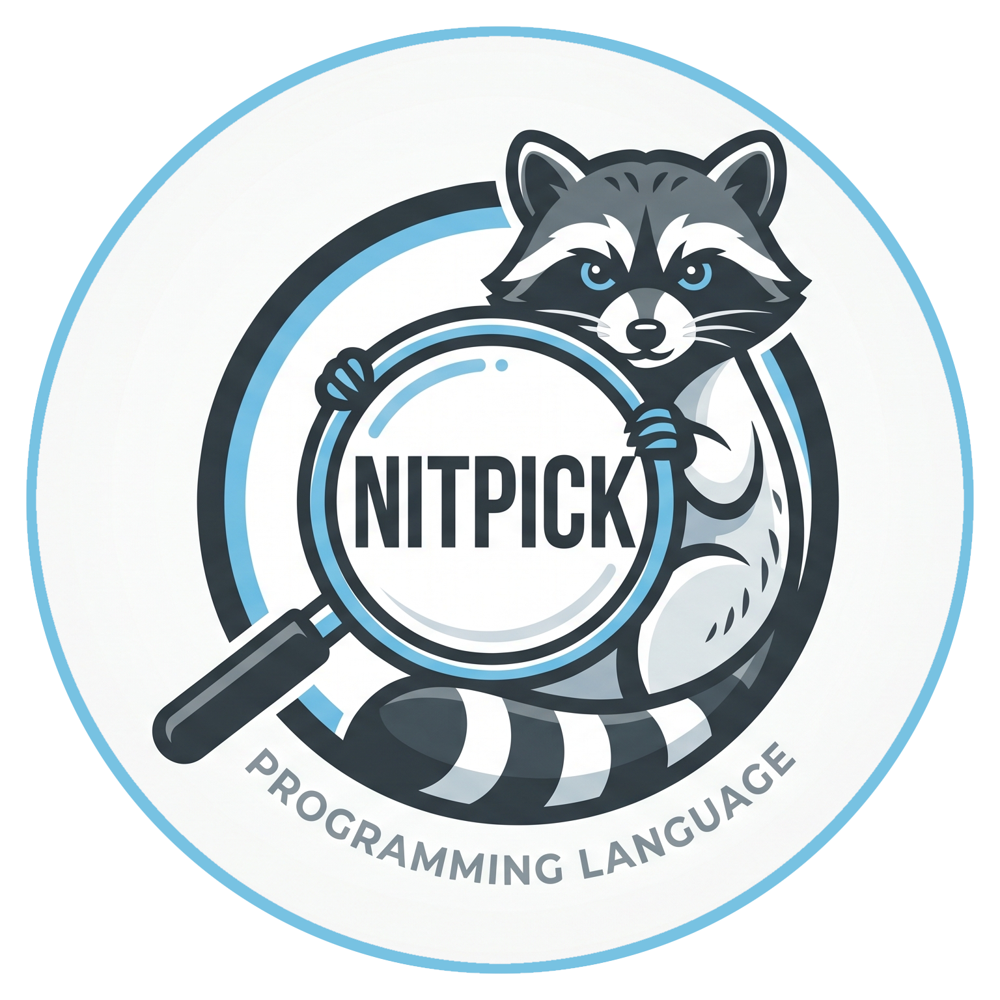

# nitpick-packages

<p align="center">
	
</p>

Ecosystem package libraries for the [Nitpick programming language](https://github.com/alternative-intelligence-cp/nitpick).

**113 packages** — see [PACKAGES.md](PACKAGES.md) for the full categorized list and [STDLIB.md](STDLIB.md) for standard library modules.

## Packages

| Package | Description |
|---------|-------------|
| nitpick-2048 | 2048 puzzle game — Raylib GUI + MongoDB high-score persistence |
| nitpick-adarkroom | A Dark Room — TUI text adventure port |
| nitpick-archive | Tar (ustar) archive writer and reader |
| nitpick-args | CLI argument parsing via /proc/self/cmdline |
| nitpick-ascii | ASCII classification and conversion |
| nitpick-audio | Software audio synthesis — 4-channel mixing |
| nitpick-base64 | Base64 encoding/decoding |
| nitpick-bigdecimal | Arbitrary precision decimal arithmetic |
| nitpick-bits | Bit manipulation — test/set/clear/flip, popcount |
| nitpick-bitset | Fixed-size bit sets with set operations |
| nitpick-blackjack | Blackjack — Raylib GUI + MongoDB wallet persistence |
| nitpick-body-parser | HTTP body parser — URL-encoded, content-type |
| nitpick-buf | Byte/word packing/unpacking (little-endian) |
| nitpick-chess | Chess — Raylib GUI with native move/state validation |
| nitpick-clamp | Min, max, clamp, abs, sign |
| nitpick-cli | Rich CLI output — ANSI colors, progress bars |
| nitpick-color | RGBA color packing, pixel transforms |
| nitpick-compress | Gzip/deflate compression |
| nitpick-console | Virtual 8-bit console address map |
| nitpick-conv | Saturating narrowing and float/int conversion |
| nitpick-cookie | HTTP cookie parsing and Set-Cookie builder |
| nitpick-cors | CORS header builder and origin validation |
| nitpick-cowsay | Cowsay clone with Tux and Dragon support |
| nitpick-cron | Cron-style task scheduling |
| nitpick-crypto | SHA-256, MD5, HMAC hashing |
| nitpick-csv | CSV parser and writer (RFC 4180) |
| nitpick-cuda | CUDA Runtime API bindings — device, memory, kernel launch |
| nitpick-datetime | Date/time — timestamps, formatting |
| nitpick-db-pool | Generic database connection pool |
| nitpick-decision-t | Two-axis gradient decision construct |
| nitpick-deque | Double-ended queue — O(1) push/pop |
| nitpick-diff | Sequence diffing — LCS, edit distance |
| nitpick-display | Terminal display — cursor, colors, dimensions |
| nitpick-dns | DNS resolution — forward, reverse, validation |
| nitpick-doom | Raylib 3D raycasting Doom-style demo |
| nitpick-endian | Byte-swap and rotation utilities |
| nitpick-entangled | Coupled DecisionGradients with propagation |
| nitpick-env | Environment variable management |
| nitpick-fixed | Q32.32 fixed-point arithmetic |
| nitpick-fm | Terminal File Manager — interactive TUI with selection and execution |
| nitpick-freq | Frequency/period arithmetic |
| nitpick-fs | Filesystem utilities |
| nitpick-fsm | Finite state machine — dynamic transitions |
| nitpick-ftp | FTP command builder and reply parser |
| nitpick-glob | Glob pattern matching — *, **, ? wildcards |
| nitpick-gradient-field | Spatial decision field (DGT emitter) |
| nitpick-graph | Graph data structures and algorithms |
| nitpick-gtk4 | GTK4 native desktop GUI bindings |
| nitpick-hash | Non-cryptographic hashing — FNV-1a, djb2 |
| nitpick-http | HTTP client — GET/POST/PUT/DELETE via libcurl |
| nitpick-i18n | Internationalization — key/value dictionary catalog |
| nitpick-image | Image loading and writing via stb_image |
| nitpick-input | Key mapping, button bitmask, press/release |
| nitpick-json | JSON tokeniser — byte-level scanning |
| nitpick-jwt | JSON Web Token — sign, verify, decode |
| nitpick-log | Structured logging — levels, timestamps |
| nitpick-lru | LRU cache — O(1) get/put, clock-based eviction |
| nitpick-map | Hash map (string→int64), FNV-1a, arena-backed |
| nitpick-markdown | Markdown to HTML compiler |
| nitpick-math | Trig, exponential, logarithm via libm |
| nitpick-matrix | Dense matrix — add, multiply, transpose |
| nitpick-mime | MIME type detection from file extensions |
| nitpick-mock | Mock/stub framework for testing |
| nitpick-mongo | MongoDB driver via libmongoc |
| nitpick-msgpack | MessagePack binary serialization |
| nitpick-mux | Bit-select, field insert/extract, conditional mux |
| nitpick-mysql | MySQL client via libmysqlclient |
| nitpick-njless | Interactive JSON viewer and explorer |
| nitpick-nmdcat | Markdown viewer for the terminal |
| nitpick-ndog | A simple command-line DNS client |
| nitpick-nkibi | A simple, lightweight terminal text editor |
| nitpick-nmotus | Dead simple password generator |
| nitpick-nnotox | Filename sanitizer that removes unsafe characters |
| nitpick-nnetscanner | Simple TCP port scanner for local targets |
| nitpick-nscooter | Simple command-line find and replace tool |
| nitpick-nneeds | Checks if binaries are installed and prints their versions |
| nitpick-nfend | An arbitrary-precision unit-aware calculator for mathematical expressions |
| nitpick-str-builder | High-performance C-backed string builder library |
| nitpick-ndomain-check | Quickly check if a domain name is available via RDAP |
| nitpick-nzeitfetch | Instantaneous system information fetcher |
| nitpick-nhexyl | A command-line hex viewer for inspecting binary files |
| nitpick-ndusage | Fast, recursive disk usage utility for finding large files/folders |
| nitpick-ntere | A fast TUI directory browser (alternative to `cd + ls`) |
| nitpick-nn | Neural network framework built on nitpick-matrix |
| nitpick-nkondo | Fast TUI utility to find and delete heavy project directories |
| nitpick-nrura | An interactive TUI scratchpad designed for building and debugging shell pipelines with live preview execution. |
| nitpick-nregname | A terminal-based interactive mass file renamer with real-time preview |
| nitpick-nstrace | A terminal UI for dynamically exploring and filtering `strace` logs of an executed command. |
| nitpick-opengl | OpenGL 3.3 Core — shaders, buffers, 3D math |
| nitpick-orm | SQL query builder — Postgres, MySQL, SQLite |
| nitpick-natuin | A fuzzy-finding TUI for searching and displaying ~/.bash_history, utilizing live filtering and terminal components. |
| nitpick-perlin | Perlin and Simplex procedural noise generation |
| nitpick-plot | 2D plotting library via Raylib |
| nitpick-postgres | PostgreSQL client via libpq |
| nitpick-pqueue | Priority queue (min-heap) |
| nitpick-pubsub | Lightweight event bus and publish-subscribe system |
| nitpick-rand | xorshift64 PRNG |
| nitpick-rate-limit | Token-bucket rate limiter with HTTP headers |
| nitpick-raylib | Raylib bindings — 2D, audio, input |
| nitpick-redis | Redis client via hiredis |
| nitpick-regex | POSIX extended regular expressions |
| nitpick-resource-mem | Consumable expiring memory cells |
| nitpick-result | Extended Result/Option combinators |
| nitpick-retry | Retry with exponential backoff |
| nitpick-ringbuf | Circular buffer (FIFO) |
| nitpick-router | Express-style HTTP router |
| nitpick-sdl2 | SDL2 — windowing, 2D rendering, events |
| nitpick-semver | Semantic versioning parsing |
| nitpick-server | HTTP/1.1 server — request parsing, responses |
| nitpick-session | Server-side session management |
| nitpick-smtp | SMTP command builder and reply parser |
| nitpick-socket | TCP/UDP sockets — connect, listen, send |
| nitpick-sort | Sorting — quicksort, insertion, merge |
| nitpick-sqlite | SQLite3 — open, query, transactions |
| nitpick-ssh | SSH client — forwarding and interactive sessions |
| nitpick-static | Static file serving — MIME, path resolution |
| nitpick-stats | Descriptive statistics — mean, median, stddev |
| nitpick-str | High-level string manipulation |
| nitpick-sync | Synchronization primitives — WaitGroup, Semaphore, Latch |
| nitpick-template | String template engine |
| nitpick-test | Lightweight test framework |
| nitpick-tetris | Full Tetris clone — 7-bag, hold, ghost piece |
| nitpick-tictactoe | Tic-tac-toe — Raylib GUI |
| nitpick-toml | TOML configuration parser |
| nitpick-tui | Text User Interface toolkit |
| nitpick-unix-socket | Unix domain socket client/server |
| nitpick-url | URL parsing, encoding, decoding |
| nitpick-uuid | 128-bit UUID arithmetic |
| nitpick-vec | 2D/3D float64 vector math |
| nitpick-vector | Vector database and embedding memory — cosine similarity search |
| nitpick-vulkan | Vulkan bindings — instance, device, pipeline helpers |
| nitpick-web-template | REST API boilerplate — server + router + db-pool |
| nitpick-websocket | WebSocket protocol — handshake, state, frames |
| nitpick-xml | XML parsing and querying |
| nitpick-yaml | YAML parser with dotted-path access |
| nitpick-zigzag | Zigzag encoding for varint serialization |

## Installation

### Via npkpkg
```bash
npkpkg install nitpick-test
```

### Via APT (Debian/Ubuntu)
```bash
sudo apt install nitpick-packages
```

### Manual Build (using npkbld)
1. Clone this repository: `git clone https://github.com/alternative-intelligence-cp/nitpick-packages.git`
2. Navigate to the specific package directory (e.g., `cd packages/nitpick-fm`).
3. Build the package using the Nitpick builder:
```bash
npkbld build .
```
4. Run the generated binary: `./.nitpick_make/build/bin/nitpick-fm`

For standard Nitpick library modules, you can also copy the desired package directory into your project or Nitpick's package search path.

## Package Structure

Each package follows the standard Nitpick package layout:

```
nitpick-<name>/
├── nitpick-package.toml    # Package manifest
├── src/
│   └── <name>.npk       # Source code
├── tests/
│   └── test_<name>.npk  # Tests
└── README.md
```

## Contributing

1. Fork this repository
2. Create your package under `packages/`
3. Include `nitpick-package.toml`, source, and tests
4. Submit a pull request

## License

AGPL-3.0 — see [LICENSE.md](LICENSE.md)
